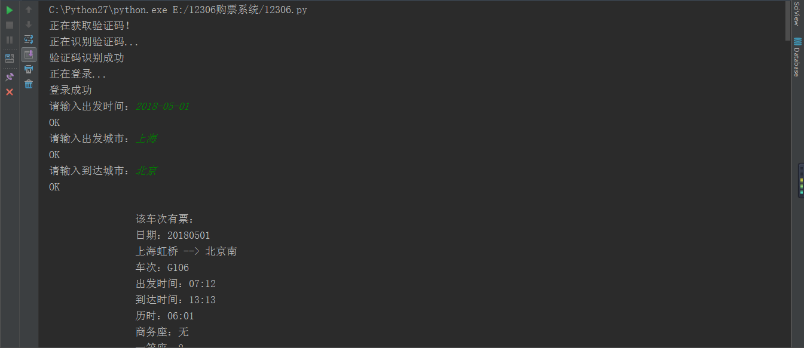
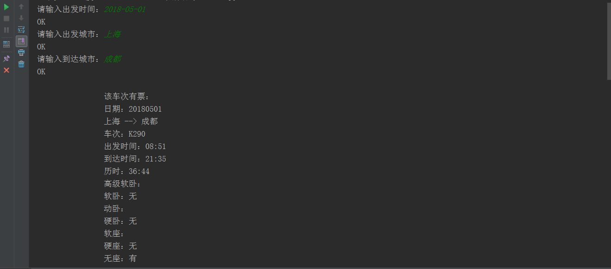
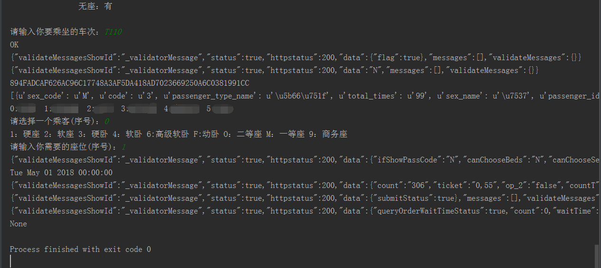
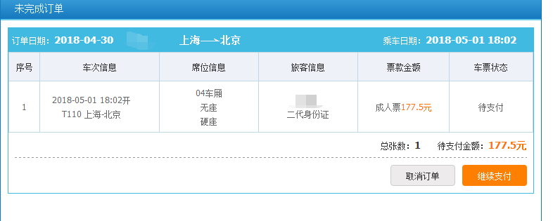

12306抢票软件
============

* 编写语言：Python2.7
* 运行限制：Linux平台，或者Windows下的IDE，否则会乱码
* 必须条件：去若快打码注册账号，充值一元否则无法登陆
* 注意事项：需要在user.py这个文件下输入你的账号和密码
* 功能：
	>登录无需输入验证码,1块钱71次 
	>查票功能 
	>买票功能 
	>高峰期可能存在验证码 
	>如遇到买票失败，请在留言区反馈 

<h3>登录页面</h3>

<h3>查票页面</h3>

<h3>买票页面</h3>

<h3>订单结果</h3>
